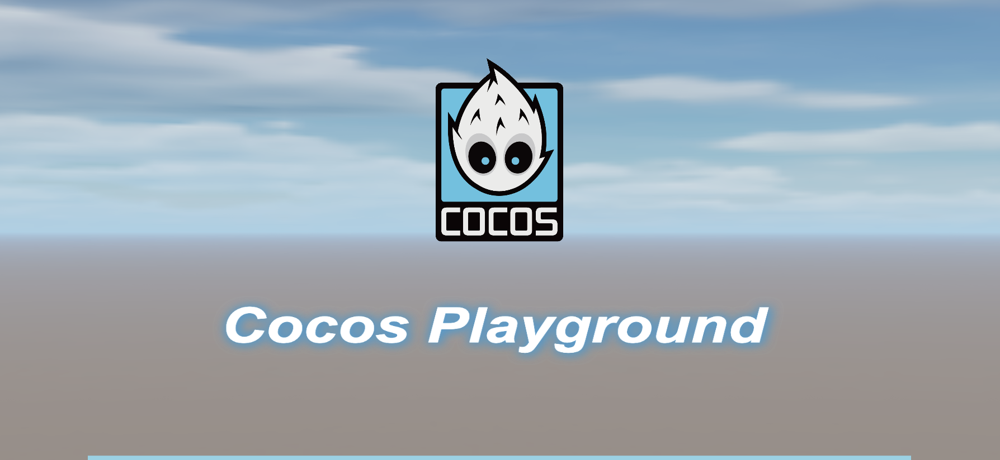
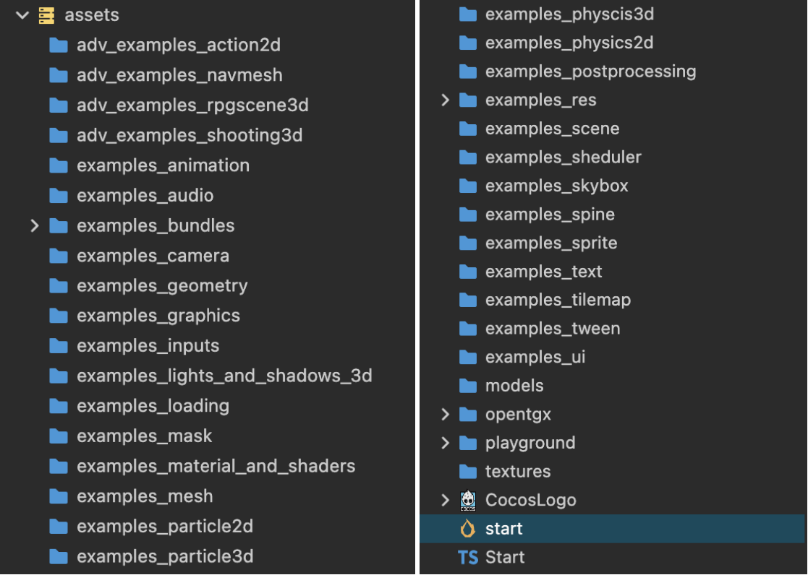

# CocosPlayground
## What is it?
Cocos Playground is a website to show high-quality examples  of Cocos Creator online, it makes people easy to learn Cocos Creator.

The online version will come soon.

## How to use the source code?
### Download Cocos Creator
To build it on your local device, you need to download Cocos Creator first.

[www.cocos.com/creator](https://www.cocos.com/creator)

### Get Source Code
Download the source code from this repository. Put it anywhere on your local device.

### Open in Cocos Creator
1. Launch the Cocos Dashboard.
2. Install Cocos Creator 3.8.2
3. Click the 'Import' button.
4. Locate to the directory of the source code.
5. Select the 'CocosCreatorExamples' folder.
6. Confirm to start importing.
7. Choose the 'start' scene to run.
8. Give the required parameters to access the corresponding example like :http://localhost:7456/?s=scene-boundle-loading&b=examples_bundles, where `s` is the scene name and `b` is the bundle name.

This project is still in progress, welcome to contribute.

To simplify the development of this project, we use OpenTGX to handle the UI, Cameras, Joysticks, etc. If you want to know more about OpenTGX, please visit [OpenTGX](https://github.com/MrKylinGithub/OpenTGX).